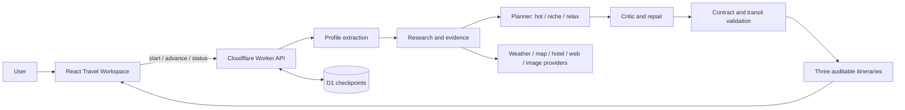

# Smart Travel

**An open-source, evidence-aware multi-agent travel planning system for Chinese cities.**

Smart Travel（智能旅游助手）把自然语言旅行需求转化为三套可审计、可恢复的中国城市行程。它不是简单让大模型生成攻略，而是把需求提取、外部数据查询、研究取证、路线优化、独立审查、修复和最终交通核验组织成持久化工作流。

## What it does / 项目能力

- Extracts dates, party size, budget, pace, preferences, exclusions, and must-visit places from natural language.
- Runs a resumable 17-stage planning workflow; V30 splits long stages into durable, idempotent micro-checkpoints instead of one long Worker request.
- Produces exactly three differentiated itinerary variants: `hot`, `niche`, and `relax`.
- Collects weather forecasts, map entities, transit candidates, hotel candidates, images, and controlled web evidence.
- Optimizes route buckets against user constraints, travel time, opening information, meal windows, night views, crowd risk, and itinerary diversity.
- Uses independent critic, contract audit, targeted repair, final transit validation, and result compilation stages.
- Persists jobs, stage artifacts, leases, provider attempts, and checkpoints in Cloudflare D1.
- Resumes after refresh or transient network failure and supports real server-side cancellation and retry.

## Why it is different

Smart Travel treats data quality as part of the product contract:

- Evidence is attributed and ranked; snippets alone do not verify critical facts.
- Unknown and conflicting facts remain explicit instead of being upgraded to certainty.
- Transit legs distinguish verified provider results from estimates.
- Hotel results are candidates and source-backed reference prices, never invented availability or transaction prices.
- Crowd information is a risk prediction unless an authoritative real-time source actually supplied it.
- Planner output is audited and repaired against required places, supported day count, time windows, meals, and final transit feasibility.
- Durable checkpoints prevent a single provider or model failure from discarding all completed work.

## Architecture



See [docs/architecture.md](docs/architecture.md) for the request flow, all 17 stages, persistence semantics, provider boundaries, and module responsibilities.

V30 keeps the public 17-stage contract, but one `/api/plan/advance` now executes only one bounded work unit. The normal soft budget is 40 seconds, external/model calls are capped at 30 seconds, and long throttle/backoff waits are represented by `retryNotBefore` rather than sleeping inside a Worker request.

## Project structure

| Path | Responsibility |
| --- | --- |
| `app/` | Vinext route entry, global metadata, and route-scoped styles. |
| `app/travel/[[...tripId]]/` | Thin route composition root for the travel workspace. |
| `travel/` | Frontend feature/workspace: React UI, state, local history, planning lifecycle, and API client. It is not a duplicate route directory. |
| `worker/index.ts` | Cloudflare Worker entry and Vinext handoff. |
| `worker/travel-api.ts` | Travel API and high-level planning orchestration façade. |
| `worker/providers/` | Provider transport and POI normalization boundaries. |
| `worker/planning/` | Planner response normalization, hard-constraint coverage, and timeline safety repair. |
| `worker/domain/` | Contracts, routing, evidence, trust, crowd risk, research, compiler, and other domain algorithms. |
| `worker/workflow/` | V30 advance budget, model timeout, runtime telemetry, and durable research micro-checkpoint runner. |
| `worker/persistence.ts` | D1 jobs, artifacts, events, leases, cache, provider health, quotas, and rate limits. |
| `tests/` | Domain, contract, lifecycle, recovery, and structural regression tests. |
| `drizzle/` | Authoritative D1 migrations. |
| `.openai/` | OpenAI Sites project and D1 binding configuration. |

## Quick start

### Requirements

- Node.js 22.13.0 or newer
- npm with the committed `package-lock.json`

```bash
npm ci
cp .dev.vars.example .dev.vars
npm run dev
```

On Windows PowerShell:

```powershell
Copy-Item .dev.vars.example .dev.vars
```

Open `http://localhost:3000/travel/`.

### Environment variables

Put local server credentials only in the ignored `.dev.vars` file. The committed `.dev.vars.example` documents the supported variables without real secrets.

| Variable | Purpose |
| --- | --- |
| `AI_API_KEY` | Server-side key for the OpenAI-compatible Yuanjing endpoint. |
| `AI_API_BASE_URL` | OpenAI-compatible chat-completions endpoint. |
| `AI_*_MODEL` | Purpose-specific extraction, research, planning, critic, repair, and explanation models. |
| `AMAP_WEB_KEY` | Optional Amap Web Service access for official district and POI lookups. |
| `UNSPLASH_ACCESS_KEY` | Optional image fallback. |
| `RATE_LIMIT_SALT` | Server-side salt for public rate-limit identifiers. |
| `DAILY_PLAN_QUOTA` | Daily planning quota. |
| `NEWSNOW_BASE_URL`, `SOCIAL_MCP_*` | Optional, authorized trend-provider integrations. |

`DEEPSEEK_API_KEY` remains a legacy-compatible alias. Never expose any key to browser JavaScript or commit `.env*` / `.dev.vars`.

## Validation

```bash
npm run test:domain
npm run typecheck -- --incremental false
npm run lint
npm run build
```

`npm test` currently runs the domain suite followed by the production build.

## Data reliability

- **Weather:** Open-Meteo provides a 16-day forecast snapshot. Dates outside the available window stay unavailable and are not replaced with today's weather.
- **Hotels:** only provider-returned candidates are shown. Prices are source-backed references, not guaranteed transaction prices or availability.
- **Map and transit:** Amap or other provider results are marked verified only when returned for the exact leg; fallbacks remain estimates.
- **Crowd risk:** a prediction with confidence and evidence coverage, never a fabricated live visitor count.
- **Opening and reservation:** missing, stale, or conflicting information stays unknown/conflicting and is surfaced for pre-departure verification.
- **Web evidence:** external pages are untrusted inputs, critical facts require stronger support, and source conflicts are retained.

## Contributing

External contributors should read [CONTRIBUTING.md](CONTRIBUTING.md), fork the repository, create a focused branch, and submit a pull request. Security concerns should follow [SECURITY.md](SECURITY.md).

## License

Smart Travel is available under the [MIT License](LICENSE).
