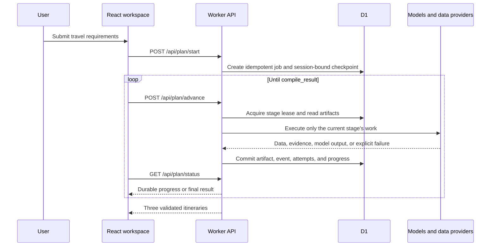

# Smart Travel Architecture

This document describes the architecture implemented in the current repository. It does not describe proposed or future components.

## System boundary

Smart Travel is a Vinext/React application deployed as an OpenAI Site on Cloudflare infrastructure. The browser renders the travel workspace and drives one durable planning stage at a time. The Cloudflare Worker owns API behavior, external provider calls, model orchestration, validation, and D1 persistence.

The full planning task is not placed in `waitUntil()`. If the browser closes, no new stages are launched; completed D1 artifacts remain available for reconnection and retry.

## Frontend

- `app/travel/[[...tripId]]/page.tsx` is the thin route composition root.
- `travel/TravelWorkspaceApp.tsx` composes the four-stage workspace and final result experience.
- `travel/components/` owns requirement input, provider/research progress, validation surfaces, maps, and itinerary dashboards.
- `travel/hooks/usePlanningLifecycle.ts` coordinates start, reconnect, retry, cancellation, and progress state.
- `travel/services/planningApi.ts` drives `/api/plan/advance`, polls status, and keeps a non-authoritative sessionStorage pointer to the active D1 job.
- `travel/state/` and `travel/data/` preserve compatible local workspace history and UI state.

The HttpOnly session cookie and D1 job ownership are authoritative. Browser storage never contains provider credentials.

## Worker API

`worker/index.ts` routes `/api/*` to `handleTravelApi`; unmatched requests continue to the Vinext application. `worker/travel-api.ts` is the API and orchestration façade.

| Endpoint | Purpose |
| --- | --- |
| `POST /api/plan/start` | Validate input and create or reconnect to an idempotent job. |
| `POST /api/plan/advance` | Execute at most one bounded durable work unit inside the next incomplete stage. |
| `GET /api/plan/status` | Return progress, RUNNING/WAITING/STALLED runtime state, events, provider attempts, terminal error, or result. |
| `GET /api/plan/active` | Find the session's active job after refresh or reconnect. |
| `POST /api/plan/retry` | Resume an errored job from the first incomplete checkpoint. |
| `POST /api/plan/cancel` | Persist cancellation so an in-flight lease cannot commit later. |
| `POST /api/agent` | Explain an existing plan with compact context. |
| `POST /api/image` | Resolve a traceable destination/POI image candidate. |
| `POST /api/monitor` | Evaluate actionable trip-time adjustment triggers. |
| `GET /api/providers/status` | Return provider health and persistence metrics. |

Rate limits are endpoint-specific. Session access uses a Secure, HttpOnly, SameSite=Strict cookie whose value is hashed before persistence lookup.

## Seventeen-stage planning lifecycle

The ordered `WORKFLOW_STAGES` contract is:

1. `parse_profile` — deterministic and model-assisted requirement extraction.
2. `collect_sources` — weather, attraction, and hotel candidate collection.
3. `build_knowledge` — required-entity verification, trend, seasonality, and crowd-risk preparation.
4. `build_matrix` — transparent transit candidate matrix.
5. `planner_research` — gap selection, controlled web research, evidence scoring, and fact synthesis.
6. `planner_memo` — optional deep planning memo; skipped when deep reasoning is disabled.
7. `variant_hot` — classic/high-coverage itinerary.
8. `variant_niche` — nature/photography itinerary.
9. `variant_relax` — lower-density itinerary with more buffers.
10. `critic_review` — independent cross-plan review.
11. `audit_initial` — first hard-constraint audit.
12. `repair_round_1` — targeted repair of initial violations.
13. `audit_round_1` — audit of the first repair.
14. `repair_round_2` — final targeted repair where still required.
15. `audit_final` — deterministic final hard-constraint audit.
16. `final_transit` — exact adjacent-leg verification and timeline reflow.
17. `compile_result` — final contract, reliability, provenance, and UI result compilation.

`hot`, `niche`, and `relax` are stable IDs, not display-only labels. Every variant must contain the supported number of days and every user-required attraction.

## V30 execution budget and micro-checkpoints

The public workflow remains the same 17 stages. Internally, long work is constrained by a 40-second advance soft budget, a 24-second external-call ceiling, and a 6-second commit reserve. After an external timeout, another model candidate is started only when at least eight seconds of useful call time remain; this prevents a doomed fallback call from pushing the HTTP request into the platform disconnect boundary. A model slot that is more than two seconds away becomes a durable WAITING state with `retryNotBefore`; the Worker does not sleep across that interval. Lease contention is handled the same way, with the retry time aligned to the persisted lease expiry instead of a fixed client-side delay.

`planner_research` persists `research:state:v30` plus bounded operation artifacts. Its cursor advances through `plan_queries`, query-sized `search_batch`, URL-sized `fetch_batch`, deterministic `extract_batch`, optional `refine_batch`, `fuse`, and `finalize`. Each round reads at most three results per query and twelve pages total, then sends at most twenty-four evidence rows through optional AI refinement. Deterministic operation IDs make artifact-first/cursor-second crash recovery idempotent: an existing operation artifact is reused after lease expiry or process interruption.

`worker/workflow/advance-budget.ts`, `model-execution.ts`, `runtime-state.ts`, and `workflow/research/*` are strict TypeScript modules. New execution architecture must stay outside the legacy `travel-api.ts` type-check exemption.

## Planning and domain modules

- `worker/planning/planner-normalization.ts` normalizes variable model response shapes, recovers incomplete variants, restores required-place coverage, binds matrix facts, and performs final meal/time-window safety repair.
- `worker/domain/planner-v4.ts` defines planner context checks, audits, deterministic profile merging, opening ranges, and provider settlement.
- `worker/domain/route-optimizer.ts` is the primary minute-based route scheduler: time-window insertion, objective presets, 2-opt, relocate/swap, cross-day moves, deterministic LNS, weather/crowd/cost penalties, duration ranges, fatigue, critical slack, switch cost, and experience continuity.
- `worker/domain/availability.ts` compiles split opening hours, last admission, and weekday closures into dated windows.
- `worker/domain/constraint-model.ts` separates hard constraints, penalty-based soft constraints, preferences, assumptions, unknowns, source priorities, and explicit conflicts before planning.
- `worker/domain/fact-graph.ts` builds the shared entity/fact/source/derived graph with versions, aliases, validity, confidence, and provenance.
- `worker/domain/diversity.ts`, `robustness.ts`, and `reproducibility.ts` provide multi-dimensional variant diversity, seeded Monte Carlo simulation, and replay hashes.
- `worker/domain/model-budget.ts` caps output tokens by model role; `workflow-dag.ts` exposes the logical dependency DAG while the public 17-checkpoint contract remains compatible.
- `worker/domain/offline-benchmark.ts` runs 120 deterministic fixed scenarios without external providers or models.
- `worker/domain/contract.ts` enforces the final three-plan API contract.
- `worker/domain/compiler.ts`, `dependency-graph.ts`, `fragility.ts`, and `stress-test.ts` derive execution blocks, dependencies, buffers, fragility, and simulations.
- `worker/domain/model-routing.ts` selects verified Flash/Pro model candidates, classifies failures, and maintains short-lived circuit breakers.
- `worker/domain/profile-extraction.ts` merges deterministic text facts ahead of conflicting form defaults or model output.
- `worker/domain/research-*`, `search-orchestrator.ts`, `evidence.ts`, and `decision-trace.ts` plan searches, sanitize untrusted pages, score/deduplicate evidence, synthesize facts, and retain traceability.
- `worker/domain/crowd-*` and `traffic-coverage.ts` keep predicted crowd risk and verified/estimated transit coverage explicit.

## Provider boundary

- `worker/providers/provider-client.ts` owns HTTP/MCP transport, timeouts, bounded retries, caching, and provider-health telemetry.
- `worker/providers/poi-normalization.ts` converts Amap, Wikipedia, and Nominatim records into the shared candidate shape and applies conservative POI filters.
- Weather is fetched from Open-Meteo and retained as a 16-day snapshot.
- Amap Web Service and MCP calls provide district, POI, image, hotel, dining, and transit candidates when configured and available.
- Hotel, image, news/trend, and optional social providers may degrade independently; missing output does not authorize fabricated fallback facts.
- External pages are treated as untrusted content and pass through access-state detection and sanitization before evidence extraction.

## D1 persistence and recovery

`worker/persistence.ts` owns:

- planning jobs and session ownership;
- stage artifacts and ordered events;
- leases, nonces, heartbeats, and stale-job expiry;
- provider attempts and health metrics;
- persistent provider/research cache entries;
- idempotency keys, rate limits, quotas, and runtime metrics; and
- cancellation and retry state transitions.

Each stage acquires a lease, reads previously committed artifacts, performs its work, checks that cancellation/ownership still permit a commit, writes its artifact, and releases the lease. Retry resumes at the first incomplete stage rather than rerunning successful stages. Deterministic validation failures have bounded retry limits so unchanged invalid output cannot loop indefinitely.

The authoritative schema history is in `drizzle/`. `db/schema.ts` is a supporting type description and must not be changed as a substitute for a migration.

## Data reliability contracts

- Critical facts cannot become verified from search snippets alone.
- Conflicting sources remain conflicting until stronger evidence resolves them.
- Forecast data outside the available weather horizon remains unavailable.
- Hotel prices are provider-returned references, not availability guarantees or transaction prices.
- Crowd scores are predictions with confidence/evidence context, not live counts.
- Transit coverage separately counts verified and estimated legs.
- Required attractions cannot be removed to satisfy crowd, opening, or optimization preferences; unresolved risk is surfaced instead.
- Contract `3.0` requires algorithm versions, a fact graph, seeded robustness simulation, reproducibility metadata, and diversity metrics for each alternative.

## Four decision layers

The planner keeps four responsibilities separate:

1. Fact — providers, research evidence, Unknown/conflicting states, validity windows, and derivations.
2. Constraint — hard feasibility and penalty-based soft preferences compiled before route generation.
3. Optimization — deterministic candidate selection and minute scheduling under time, transit, meal, weather, crowd, cost, fatigue, and diversity objectives.
4. LLM — requirement extraction, high-level strategy, semantic critique, and last-resort semantic repair. It cannot invent IDs or own exact times.

The UI and D1 still expose the stable 17 checkpoints. V30 additionally exposes durable micro-step state and RUNNING/WAITING/STALLED telemetry; the dependency DAG continues to describe logical relationships without changing the public planning contract.

## Deployment invariants

- `.openai/hosting.json` is required by `vite.config.ts` and contains the Sites project and D1 binding. Its `project_id` and binding name are intentionally committed.
- `build/sites-vite-plugin.ts` is source tooling imported by Vite, not a disposable build artifact.
- D1 migrations remain in `drizzle/`.
- Server credentials belong in ignored local `.dev.vars` files or hosted runtime configuration, never in frontend code or Git.
